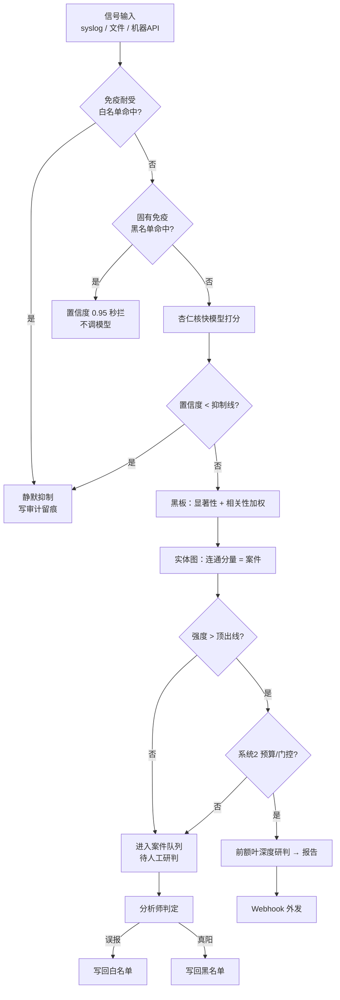

# 神经免疫 · NeuroImmune

一个把 **神经系统 + 免疫系统** 的隐喻，映射到 **SOC 告警降噪与研判** 的工作台。

核心思路：用「杏仁核（快、便宜）→ 前额叶（慢、贵）」的双层模型 + 「固有免疫 / 免疫耐受」两套确定性规则，把海量告警层层压缩成少数需要人工研判的**案件**，并在每一步决策都留下可审计的痕迹。

> 无任何模型 API key 也能跑通全流程——内置 `MockClient` 用关键词规则替代 LLM，先把架构跑起来。

---

## 隐喻对照

项目自带「生物术语 / 安全术语」双术语体系（前端 `frontend/src/terms.tsx` 可一键切换）。下表是隐喻到真实功能的映射：

| 生物/神经术语 | 安全术语 | 实际功能 | 代码位置 |
|---|---|---|---|
| 丘脑 Thalamus | 原始告警 | 原始告警流视图（含被抑制项 + 抑制原因） | `GET /api/thalamus` |
| 海马体 Hippocampus | 关联分析 | 全局实体关系图 + 事件下钻 | `GET /api/hippocampus` |
| 杏仁核 Amygdala | 初筛模型 | 对单条告警快速打分（可疑/置信度/理由） | `prototype/amygdala.py` |
| 前额叶 / 系统2 System2 | 深度分析模型 | 对升级案件做结构化深度研判报告 | `prototype/system2.py` |
| 黑板 Blackboard | 全局工作区 | 统一 Event 模型 + 显著性/相关性加权 | `prototype/blackboard.py` |
| 固有免疫 Innate | 检测规则（黑名单） | 已知坏签名 → 置信度 0.95 秒拦，不调模型 | `prototype/innate.py` |
| 免疫耐受 Tolerance | 白名单 | 已知好签名 → 静默抑制（降级不丢弃） | `prototype/tolerance.py` |
| 签名 Signature | 告警形状 | 掩码 IP/hash/数字，提取稳定的告警模板 | `prototype/signature.py` |
| 神经调质 Knob | 风险等级 | 风险预设，映射到三个阈值 | `prototype/config.py` |
| 睡眠巩固 Consolidate | 夜间记忆固化 | 定期蒸馏当日案件为可检索记忆 | `backend/nightly.py` |

---

## 告警处理流水线（降噪漏斗）



一条告警的完整旅程（实现在 `backend/pipeline.py`，核心判断逻辑复用 `prototype/` 不改一行）：

1. **免疫耐受**：命中「已知好」签名 → 静默降级，写入审计日志。
2. **固有免疫**：命中「已知坏」签名 → 以固定置信度 0.95 秒拦，不消耗任何模型调用。
3. **杏仁核（系统1）**：快模型对单条告警打分，置信度低于当前旋钮的 `suppress_below` 即抑制并留痕。
4. **黑板**：统一为 Event，按资产/类型相关性加权（`significance` / `boost`）。
5. **实体图**：抽取出 IP/hash/域名/资产等实体，实体共现的连通分量就是一个**案件**（`correlation_uid`）。
6. **升级**：案件强度（最高置信度 + 攻击链加成）超过旋钮的 `escalate_above` 即升级。
7. **前额叶（系统2）**：在预算窗口内对升级案件做结构化深度研判，产出 `verdict / evidence / attack_chain / iocs / remediations` 等字段的报告。
8. **闭环学习**：分析师判定误报 → 写回白名单；判定真阳 → 写回黑名单；夜间巩固把当日经验蒸馏进记忆，供后续系统2 检索参考（RAG）。

设计原则：**抑制 = 降级 + 留痕，永不静默丢弃**——每一条被压掉的告警都能在「丘脑」页看到它、看到原因，必要时一键「放回」重新进入流水线。

---

## 功能特性

| 页面 | 能力 |
|---|---|
| 看板 Dashboard | KPI 卡片、降噪率漏斗、24h/7d/30d 流量趋势、报告导出 |
| 分诊 Triage | 案件队列、状态/判定/强度过滤、批量标记误报 |
| 案件详情 CaseDetail | 攻击链 + 告警时间线 + 实体图（双向高亮）+ AI 报告 + 处置操作 |
| 丘脑 Thalamus | 原始告警流（含被抑制项）、决策留痕侧栏、放回 |
| 免疫 Immune | 白名单 / 检测规则库管理 |
| 海马体 Hippocampus | 全局实体关联图（cytoscape）+ 逐节点/边事件下钻 |
| 设置 Settings | 风险旋钮预设、模型模式（auto/real/mock）、数据接入、健康状态、术语切换 |
| 高级设置 AdvancedSettings | 阈值四档、模型接入、频率降级、唤醒门控、检测调参、syslog、来源映射、webhook |
| 用户 Users | 修改密码；管理员用户管理 + 细粒度权限 |

### 权限模型

- 认证：JWT（HS256，24h 有效期）+ bcrypt 密码哈希。
- 角色：`admin` / `user`。admin 隐式拥有全部权限。
- 四类细粒度权限（`backend/auth.py` 的 `PERMISSIONS`）：
  - `triage` — 分诊（标记/放回/改案件/外发/免疫规则）
  - `config` — 配置（旋钮/模型/检测/接入/Webhook）
  - `maintenance` — 维护（清库/夜间巩固/上传文件）
  - `users` — 用户管理

---

## 架构

两层算法核心 + 一个前端工作台：

- **`prototype/`** — 算法内核。零框架、仅依赖 `httpx`，可独立离线运行（`mock` 模式零 key）。是「脑子」。
- **`backend/`** — FastAPI 生产壳。通过 `sys.path` 注入直接 `import` prototype 模块（核心判断一行不改），在其上叠加 SQLite 持久化、鉴权、REST API、webhook 外发、报告导出。是「身体」。
- **`frontend/`** — React 18 + Vite + TypeScript 工作台，cytoscape 画实体图。是「脸」。

```
信号源 ──► backend（FastAPI:8000）
               │  导入 prototype 核心（amygdala / graph / system2 / innate / tolerance …）
               ├─► 流水线 pipeline.py ──► SQLite（alerts / cases / reports / audit_logs / users）
               ├─► syslog 接收（UDP+TCP :5514）
               ├─► webhook 外发（SOAR/SIEM/工单）
               └─► REST API（/api/*）
                        ▲
                        │ /api 代理
                     frontend（Vite:5173）
```

---

## 技术栈

**后端**（`backend/requirements.txt`）：

- Python 3.11+ · FastAPI · uvicorn · pydantic · httpx · PyJWT · bcrypt · matplotlib · python-docx
- 存储：SQLite（标准库 `sqlite3`，无 ORM）

**前端**（`frontend/package.json`）：

- React 18 · TypeScript 5 · Vite 5 · cytoscape（唯一运行时依赖之外的图库，图表为手写 SVG）

**模型层**（`prototype/llm.py`）：

- 任意 OpenAI 兼容 `/chat/completions` 端点（httpx 直连，无 SDK）
- 默认 DeepSeek：系统1 `deepseek-chat`、系统2 `deepseek-reasoner`
- 兼容 OpenRouter / Ollama / Groq / vLLM（改 `base_url` 即可）
- 无 key → `MockClient` 关键词规则，离线跑通

---

## 快速开始

### 一键启动

```bash
./start.sh
```

脚本会自动：安装缺失依赖（`pip install` / `npm install`）→ 启动后端 `:8000` → 启动前端 `:5173`，日志写入 `logs/`。syslog 接收器在 5514 端口（UDP+TCP）随后端一同监听。已在运行的服务会被自动复用。

```bash
BACKEND_PORT=8010 FRONTEND_PORT=5174 ./start.sh   # 自定义端口
```

启动后访问 http://localhost:5173 ，默认管理员账号 **`admin` / `admin`**（生产环境请用环境变量覆盖）。

### 手动启动

```bash
# 后端
cd backend && python3 -m uvicorn app:app --port 8000

# 前端（另开终端）
cd frontend && npm install && npm run dev
```

### 配置模型（可选）

复制 `prototype/.env.example` 为 `prototype/.env` 并填入 key（`llm.py` 自动读取，无需 export）：

| 变量 | 说明 | 默认 |
|---|---|---|
| `NEUROIMMUNE_API_KEY` | 系统1 模型 key | 空 = mock |
| `NEUROIMMUNE_BASE_URL` | OpenAI 兼容端点 | `https://api.deepseek.com/v1` |
| `NEUROIMMUNE_MODEL` | 系统1 模型名 | `deepseek-chat` |
| `NEUROIMMUNE_DEEP_MODEL` | 系统2（前额叶/深想）模型名 | `deepseek-reasoner` |
| `NEUROIMMUNE_SYSLOG_BIND/PORT` | syslog 监听地址/端口 | `0.0.0.0` / `5514` |
| `NEUROIMMUNE_API_TOKEN` | 机器接入鉴权 token | 空 = 免鉴权 |
| `NEUROIMMUNE_JWT_SECRET` | JWT 签名密钥 | 自动生成 `backend/secret.key` |
| `NEUROIMMUNE_ADMIN_USER/PASSWORD` | 初始管理员 | `admin` / `admin` |

---

## 项目结构

```
neuroimmune/
├── prototype/            # 算法内核（零框架，可离线 mock 跑）
│   ├── main.py           #   批处理入口（串起 tolerance→innate→amygdala→…→system2）
│   ├── amygdala.py       #   系统1 快模型打分
│   ├── system2.py        #   系统2 深度研判（结构化 JSON + 反幻觉纪律）
│   ├── blackboard.py     #   黑板：统一 Event + 显著性/相关性加权
│   ├── graph.py          #   实体图：并查集连通分量 = 案件
│   ├── innate.py         #   固有免疫：已知坏签名秒拦
│   ├── tolerance.py      #   免疫耐受：已知好签名静默
│   ├── signature.py      #   告警签名（掩码 IP/hash/数字）
│   ├── artifact.py       #   实体抽取（IP/hash/域名/资产）
│   ├── syslog.py         #   RFC3164/5424 解析 + 来源映射
│   ├── llm.py            #   模型客户端（OpenAI 兼容 + mock）
│   ├── config.py         #   风险旋钮预设（宽松/正常/保守/战时）
│   ├── visualize.py      #   自包含 HTML 观测页
│   └── data/             #   样本数据 + 运行期规则（tolerance/innate/memory）
├── backend/              # FastAPI 生产壳（导入 prototype，加持久化/鉴权/API）
│   ├── app.py            #   应用入口：路由 + 启动 syslog 监听 + 夜间巩固循环
│   ├── pipeline.py       #   核心流水线（批处理 process / 流式 process_signal）
│   ├── db.py             #   SQLite 数据层（无 ORM）
│   ├── auth.py           #   JWT + bcrypt + 角色/权限
│   ├── syslog_server.py  #   UDP+TCP syslog 接收线程
│   ├── webhook.py        #   案件外发（SOAR/SIEM/工单）
│   ├── report.py         #   报告导出（docx/md/html + matplotlib 图）
│   ├── nightly.py        #   睡眠巩固（蒸馏案件 → 记忆）
│   └── api/              #   REST 路由（auth/cases/dashboard/ingest）
├── frontend/             # React 18 + Vite + TS 工作台
│   └── src/
│       ├── pages/        #   Dashboard/Triage/CaseDetail/Thalamus/Immune/Hippocampus/Settings/…
│       ├── components/   #   GraphView(cytoscape)/TrendChart/ReportView/ExportReport/…
│       ├── api/client.ts #   后端客户端（JWT 注入 + 401 统一处理）
│       └── terms.tsx     #   生物/安全术语切换
├── logs/                 # 运行日志
└── start.sh              # 一键启动脚本
```

---

## 集成与 API

### Syslog 接入

后端启动即监听 `0.0.0.0:5514`（UDP+TCP），解析 RFC3164/RFC5424 为统一信号 `{time, source, asset, type, raw}`。来源名通过 `prototype/syslog_sources.json` 映射（优先级 `ip > tag > hostname > facility`，内置 天眼/HIDS/WAF 等示例）。

### 机器接入

```bash
curl -X POST http://localhost:8000/api/ingest \
  -H "Content-Type: application/json" \
  -H "X-API-Token: <你的token>" \
  -d '{"signals": [{"time":"...","source":"...","asset":"...","type":"...","raw":"..."}]}'
```

### Webhook 外发

案件可外发到外部 SOAR/SIEM/工单系统（`backend/webhook.py`）：支持 `escalated` / `disposition` / `manual` / `all` 触发、Bearer token、字段级 payload 过滤、测试触发。

### 报告导出

- 单案件：`GET /api/cases/{id}/export`（Markdown）
- 汇总报告：`POST /api/report/export`（`docx` / `md` / `html`，含时间范围、来源、判定等过滤）

### 关键端点速览

| 分组 | 端点 |
|---|---|
| 认证 | `/api/auth/login` · `/api/auth/me` · `/api/auth/users` |
| 案件 | `/api/cases` · `/api/cases/{id}` · `/api/cases/{id}/hippocampus` |
| 看板 | `/api/dashboard` · `/api/trend` · `/api/knob` |
| 原始告警 | `/api/thalamus` · `/api/suppressed` · `/api/audit` |
| 实体图 | `/api/hippocampus` · `/api/hippocampus/events` · `/api/entities/cases` |
| 免疫规则 | `/api/tolerance/remove` · `/api/innate/clear` 等 |
| 配置 | `/api/freq` · `/api/gating` · `/api/mode` · `/api/model` · `/api/detection` · `/api/ingest` · `/api/sources` · `/api/webhooks` |
| 运维 | `/api/reset` · `/api/consolidate` · `/api/health` · `/api/info` |

---

## 风险旋钮（神经调质）

四档预设（`prototype/config.py`），映射到三个阈值：杏仁核抑制线 `suppress_below`、顶出线 `escalate_above`、系统2 深度预算 `budget`。

| 档位 | suppress_below | escalate_above | budget | 含义 |
|---|---|---|---|---|
| 宽松 | 0.75 | 0.85 | 1 | 少上板、少深想 |
| 正常（默认） | 0.55 | 0.75 | 2 | 均衡 |
| 保守 | 0.40 | 0.62 | 3 | 多上板、敢深想 |
| 战时 | 0.25 | 0.45 | 99 | 极激进，近乎全量深想 |
