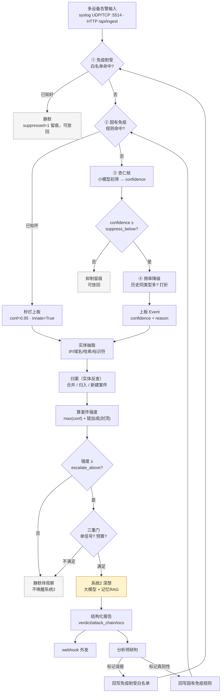
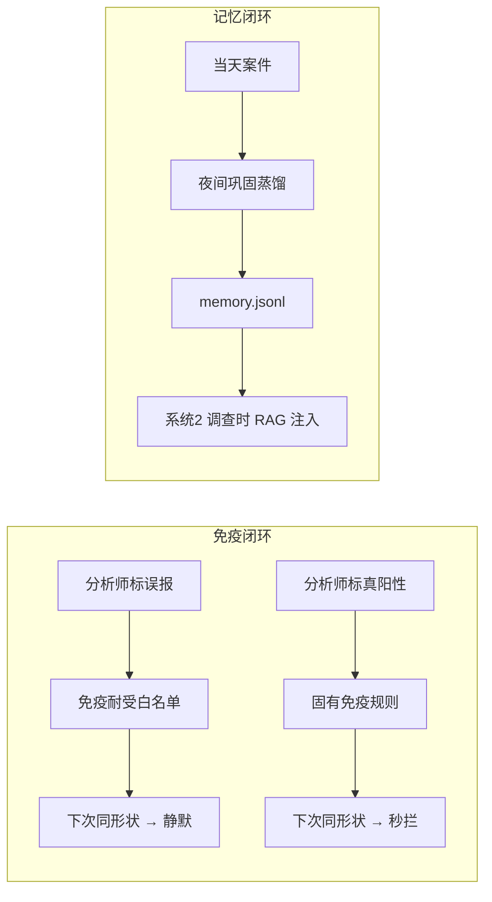

# 神经免疫 · 告警处理流程

> 本文用「一层层往下走」的方式讲清楚：一条多设备告警从接入到最终处置，系统对它做了什么、
> 在每一层用什么判断、依据什么决定「继续往下 / 静默 / 唤醒贵模型」。
> 更底层的实现细节（签名掩码、并查集、反幻觉纪律、锁与并发）见同目录《降噪与聚合.md》。

---

## 一、一句话总览

```
多设备告警 → 四道降噪闸门（顺序短路）→ 实体聚合拼链 → 案件强度 → 顶出
           → 系统2（贵模型）深想 → 结构化报告 → 分析师研判 → 回写免疫（越用越准）
```

核心思想是**分层路由**：便宜计算（规则 / 小模型）先过一遍，把海量信号压到少数「值得深想」的案件，贵模型（大模型）只在拼链完成、确凿可查的少数案件上醒来。这正是「大脑是胶水，不是模型」——模型随便换，编排逻辑不变。

---

## 二、整体架构（六层）

| 层 | 职责 | 关键模块 / 文件 |
|---|---|---|
| 输入 | 多设备告警接入 | `backend/syslog_server.py`（UDP/TCP :5514）、`api/ingest.py`、`api/dashboard.py` 上传 |
| 降噪 | 四道闸门压误报、省算力 | `tolerance.py`、`innate.py`、`amygdala.py`、`signature.py`、`pipeline.py`（频率降级） |
| 聚合 | 实体抽取 + 拼链归案 | `artifact.py`、`graph.py`、`pipeline.py`（流式归案） |
| 认知 | 顶出决策 + 系统2 深想 | `pipeline.py`（门控）、`system2.py` |
| 响应 | 风险旋钮（四档阈值） | `config.py`、`state.py` |
| 免疫/记忆 | 反馈回写 + 夜间巩固 | `tolerance.py`/`innate.py`（回写）、`nightly.py`（记忆）、`pipeline.py`（RAG） |

---

## 三、核心流程（分阶段）

### 阶段 0：接入

- **syslog**：UDP + TCP 监听 `:5514`，解析后入队，**多个 worker 并发消费**（worker 数 = 小模型并发数），逐条调用 `process_signal`。
- **HTTP**：`POST /api/ingest`（机器入库，共享 token 保护）、`POST /api/ingest/upload`（文件上传，用户 JWT）。
- 每条信号统一成扁平结构：`{ time, source, asset, type, raw }`。

### 阶段 1：降噪 —— 四道顺序短路闸门

命中任一闸门即终止（静默留痕，不再调用更贵的计算）。四道闸门共享同一个「签名」原语：把 IP / 哈希 / 数字掩码掉，保留语义 token（主机 / 账号 / 描述词），得到一条告警的稳定「形状」。

| 闸门 | 判断 | 命中后 |
|---|---|---|
| ① 免疫耐受（白名单） | 签名 ∈ 白名单 → **已知好** | 静默，`suppressed=1` 留痕（可放回） |
| ② 固有免疫（规则） | 签名 ∈ 规则 → **已知坏** | 秒拦，`confidence=0.95` 直接上板（`innate=True`，不再深想） |
| ③ 杏仁核（小模型初筛） | 模型输出 `confidence`，`< suppress_below` | 抑制留痕 |
| ④ 频率降级（仅流式） | 时间窗内同 `(asset, type)` 历史告警 ≥ 阈值 | 置信度按折扣打折，仍低则抑制 |

**③ 杏仁核是「小模型初筛」**：对既非已知好、也非已知坏的信号，用一个便宜模型判「这段里有没有不该发生的」，输出 `{ suspicious, confidence, reason }`。`confidence` 衡量的是**这条信号本身多可疑**（不是模型对判断的把握），正常业务必须给接近 0 的低分，只有确实可疑才给高分。低于抑制线就静默，够高才上板。

### 阶段 2：聚合 —— 实体抽取 + 拼链归案

降噪解决「少看」，聚合解决「看什么」。单条告警信息量小，攻击是一串跨资产、跨时间的动作，聚合把这串动作拼成「一个案件」。

1. **实体抽取**（`artifact.py`）：从 `asset` + `raw` 正文抽出 IP / 域名 / 哈希 / 带分隔符的标识符（主机名、账号）。
2. **归案**（`process_signal`）：用抽出的实体**反查已有案件**——
   - 命中多个 → 合并到最小 ID（`merge_case`）；
   - 命中一个 → 归入；
   - 零命中 → 按 `correlation_uid`（实体集合哈希）新建案件。
3. **案件强度**：`强度 = max(各条置信度) + chain_bonus × (告警条数 - 1)`，链加成封顶（默认 +0.30），避免无脑堆叠。

> 并发安全：归案 / 建案 / 写库在**全局归案锁**内串行（模型调用在锁外），避免同一实体并发首现时重复建案；实体写入用 `INSERT OR IGNORE` 幂等。

### 阶段 3：顶出 —— 唤醒系统2 的三重门

案件强度越过顶出线（`escalate_above`）后，还要过两重门才真正唤醒贵模型：

1. **单信号门槛**：单条告警默认不醒（`条数 ≥ 2` 或 `max_conf ≥ single_signal_floor`），要等拼链或确凿单点 IOC；
2. **预算门**：滑动窗口内最多唤醒 `budget` 个不同案件（省算力）。

被门拦下也写审计（`single_signal_skipped` / `budget_blocked`）——**抑制不是静默，全程可审计**。

### 阶段 4：系统2 深想 —— 贵模型 + 记忆 RAG

顶出且预算内 → 后台线程跑 `system2.deep_analyze_chain`（大模型 `deepseek-reasoner`，并发限 2）：

- **注入记忆 RAG**：按案件实体反查过去的「误报经验」（`feedback.jsonl`）和「夜间巩固记忆」（`memory.jsonl`），作为历史参考（非当前事实）。
- **结构化输出**（严格 JSON）：`verdict`（True Positive / Suspicious / False Positive / Benign / Insufficient Data）、`confidence`、`digest`、`evidence`、`attack_chain`、`iocs`、`unknowns`、`remediations`。
- **反幻觉纪律**：只用输入事实、区分「已观察 / 推论 / 未确认」、证据不足就降 confidence 并写 `unknowns`、列表宁可空不凑数。
- 报告就绪后 **webhook 外发**（可配 SOAR / SIEM / 工单）。

### 阶段 5：免疫闭环 —— 分析师回写

分析师读报告后处置，处置结果回写免疫层，**下一轮自动生效（越用越准）**：

| 处置 | 回写 | 效果 |
|---|---|---|
| 标记**误报** | 写进免疫耐受白名单 | 同形状信号下次直接静默 |
| 标记**真阳性** | 写进固有免疫规则 | 同形状信号下次秒拦上板 |
| **放回**被误压的信号 | 强制上板、按实体反查归案、触发系统2 | 修正漏报 |

### 阶段 6：夜间巩固 —— 记忆蒸馏

定时（默认 6h）把当天案件用贵模型蒸馏成 `{ summary, ttps, false_positives }`，追加到 `memory.jsonl`，供系统2 调查时 RAG 检索。**固有免疫规则不由夜间巩固自动回写**——规则只由分析师「标记真阳性」写入，避免未确认的误报被永久写进「已知坏」。

---

## 四、流程图

### 主流程



### 两个闭环



---

## 五、关键参数（默认值）

| 参数 | 默认 | 作用 |
|---|---|---|
| `suppress_below` | 0.55（正常档） | 杏仁核抑制线 |
| `escalate_above` | 0.75（正常档） | 案件顶出线 |
| `budget` | 2（正常档） | 滑动窗口内系统2 唤醒预算 |
| `chain_bonus` / `chain_cap` | 0.10 / 0.30 | 每条额外告警抬升强度 / 链加成封顶 |
| `single_signal_floor` | 0.98 | 单条告警单独唤醒地板值 |
| `budget_window` | 3600s | 预算滑动窗口 |
| `freq.window / threshold / demote` | 3600s / 10 / 0.4 | 频率降级三参数 |
| `innate_conf` / `restore_conf` | 0.95 / 0.9 | 固有免疫 / 放回信号置信度 |
| `grew` / `rag_limit` | 2 / 5 | 重分析增长阈值 / RAG 注入条数 |
| 小模型并发 / 大模型并发 | 5 / 2 | 杏仁核 / 系统2 并发上限 |

四档风险旋钮（`config.py`）：

| 档位 | suppress_below | escalate_above | budget |
|---|---|---|---|
| 宽松 | 0.75 | 0.85 | 1 |
| 正常 | 0.55 | 0.75 | 2 |
| 保守 | 0.40 | 0.62 | 3 |
| 战时 | 0.25 | 0.45 | 99 |

---

## 六、一句话设计取舍

- **分层路由（系统1/系统2）**：全量过强模型成本不可承受，强模型只在拼链完成的少数案件上醒来。
- **抑制留痕而非丢弃**：被抑制信号完整落库（`suppressed=1`），可审计、可「放回」，不会让误压的真攻击永久消失。
- **签名精确匹配而非粗匹配**：同资产不同目标可区分，避免一刀切静默整台机器；代价是变种会漏。
- **固有免疫只由分析师回写**：夜间巩固只蒸馏记忆，不自动写「已知坏」规则，防止未确认误报被永久固化。
